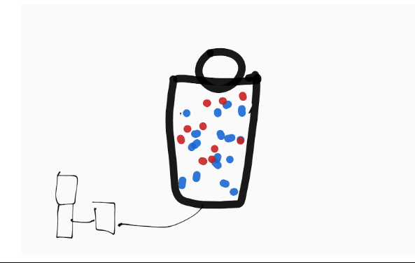
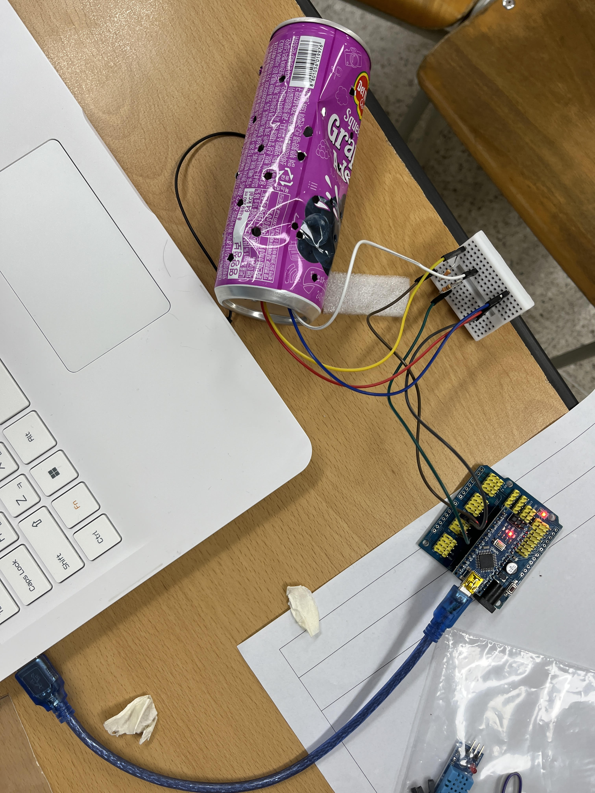
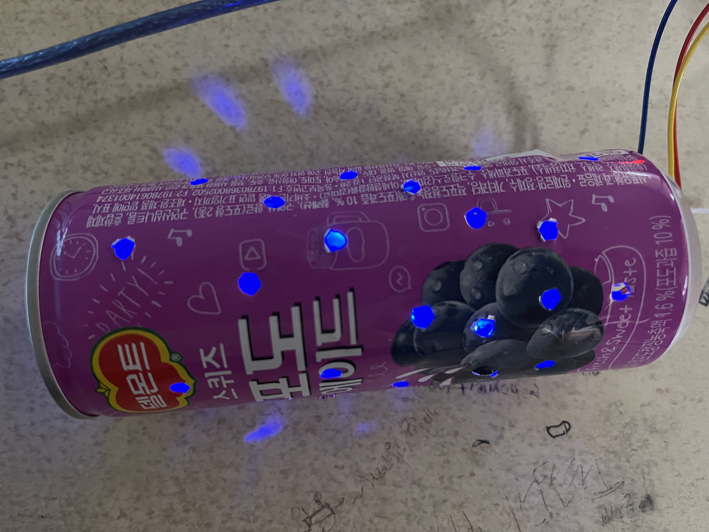

# 🌱 에코아트 프로젝트: [작품명]
      에코아트
## 📖 프로젝트 개요
- **제작자**: [오지수]
- **제작일**: [7/15]
- **소개*
> 나는 내 작품을 불을 낭비하지않고 자기전에나 불이 필요할때 킬려고 만들었다.

## 📦 사용 재료
- 사용재료-캔,아두이노,송곳,브레드보드,그림 도안,LED전구등이 있다.

## 🔧 제작 과정

### 1단계: 아이디어 스케치

- 나는 캔에 구멍을 많이 뚫어 안에서 빛이 새어나오도록 설계했다
### 2단계: 완성품

## 💭 제작 후기
### 잘된 점
- 잘된점은 내가 예상했던대로 잘 만들어졌다

### 아쉬운 점
-  빨간색 불이 좀 약해서 아쉽다

### 개선할 점
-  빨간색 불을 좀 더 밝은 색으로 바꾼다

### 내가 이미 알고 있었던 것
-  이런 캔을 사용하여 이런 작품을 만드는것을 몇번보았다

### 새롭게 배운게 된 것
-  아두이노라는것을 이번에 처음 알게 되었다

### 더 알고 싶은 것
아두이노라는 것을 더 알고 싶다

###환경적 의미
 이 작품은 버려지는 캔을 사용한 것이기 때문에 환경에 도움이 될수있고 앞으로 쓰레기를 버리지않고 이런 작품을 또 만들면 좋을 것 같다

## 📚 참고 자료
  https://www.wmtw.com/article/maine-eco-artist-mariah-reading/38818224
## 🏷️ 태그
#에코아트 #재활용 #환경보호 #DIY #창의활동

---

> 이 프로젝트는 환경 보호와 창의적 사고를 위한 교육 목적으로 제작되었습니다.
